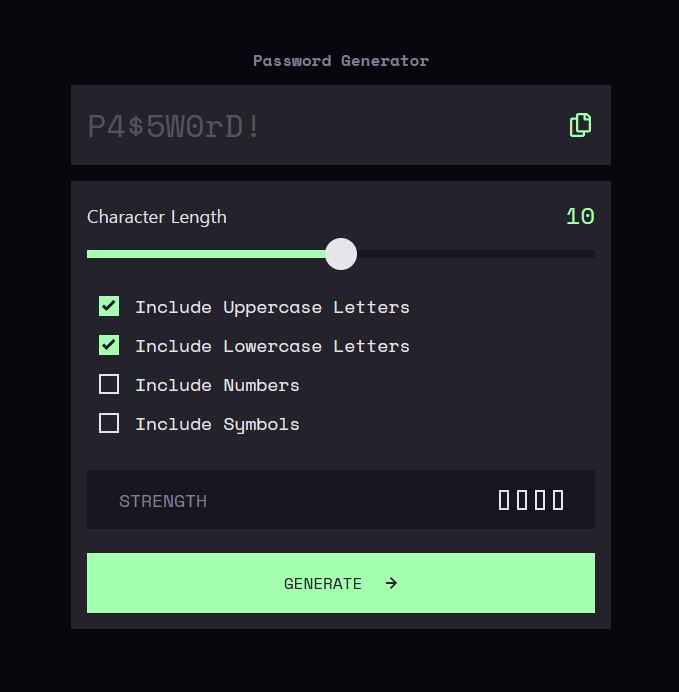

# Frontend Mentor - Password generator app solution

This is my solution to the [Password generator app challenge on Frontend Mentor](https://www.frontendmentor.io/challenges/password-generator-app-Mr8CLycqjh). The project combines reusable Every Layout patterns with a jQuery interface for generating passwords, displaying strength feedback, and copying results.

## Table of contents

- [Overview](#overview)
  - [The challenge](#the-challenge)
  - [Requirement status](#requirement-status)
  - [Screenshot](#screenshot)
  - [Links](#links)
- [My process](#my-process)
  - [Built with](#built-with)
  - [Running locally](#running-locally)
  - [What I learned](#what-i-learned)
  - [Validation](#validation)
  - [Continued development](#continued-development)
  - [Useful resources](#useful-resources)
  - [AI Collaboration](#ai-collaboration)
- [Author](#author)
- [Acknowledgments](#acknowledgments)

## Overview

### The challenge

The challenge is to build a responsive password generator with configurable character types, clipboard copying, strength feedback, and interactive control states.

The current implementation lets users:

- Choose a password length from 1 to 20 characters.
- Include uppercase letters, lowercase letters, numbers, and symbols.
- Generate a lowercase-only password when no character types are selected.
- Include at least one character from every selected type. The requested length must accommodate those types.
- See the generated password and a four-level strength indicator.
- Copy the result and see a confirmation for two seconds, with a separate screen reader status message.

Passwords use `crypto.getRandomValues()` for random selection. The strength display uses a simple length-and-character-variety rule, not an estimate of actual cracking time.

| Highest matching condition | Label | Filled bars | Color class |
| --- | --- | --- | --- |
| None of the conditions below | TOO WEAK! | 1 | `bg-red` |
| At least 8 characters and 2 character types | WEAK | 2 | `bg-orange` |
| At least 12 characters and 3 character types | MEDIUM | 3 | `bg-yello` |
| At least 16 characters and all 4 character types | STRONG | 4 | `bg-green` |

### Requirement status

The following status is based on source review, not a completed browser acceptance test.

| Requirement | Status | Remaining work |
| --- | --- | --- |
| Generate passwords using selected options | Implemented | Selected types are included; no selection defaults to lowercase. |
| Copy the generated password to the clipboard | Implemented; browser verification pending | Verify successful copying and permission failures in actual browsers. |
| Display a password strength rating | Implemented | Four levels are shown using the simple rule described above. |
| Adapt the interface to different screen sizes | Implemented in CSS; visual verification pending | Check narrow screens, long passwords, copy feedback, and zoom. |
| Show hover and focus states for every interactive element | Partially implemented | Add a visible focus indicator to custom checkboxes and verify button focus visibility. |

The slider already changes its thumb appearance on hover and focus. The copy and generate buttons have hover styles but no dedicated focus styles; browser defaults may still provide an indicator. Checkbox inputs are visually hidden with `sr-only`, and their visible replacement marks do not yet show keyboard focus.

### Screenshot



### Links

- Solution URL: [Repository](https://github.com/jonghwascript/password-generator.git)
- Live Site URL: [Live site](https://jonghwascript.github.io/password-generator/)

## My process

### Built with

- Semantic HTML, native form controls, and ARIA status messaging
- Sass, CSS custom properties, logical properties, and fluid typography
- Flexbox with Every Layout's Stack, Box, Center, Cover, and Cluster patterns
- jQuery 4.0.0, included locally
- Web Crypto and Clipboard APIs
- Gulp for Sass compilation, source maps, and file watching
- Prettier for formatting

### Running locally

Install the development dependencies:

```sh
npm install
```

Compile the Sass entry point once:

```sh
npx sass src/scss/style.scss css/style.css
```

The first path is the input stylesheet; the second is the generated CSS loaded by `index.html`. This direct Sass command uses Sass's own source map output, which may differ from the Gulp pipeline.

For the existing development workflow:

```sh
npx gulp
```

The default task formats the configured HTML and SCSS files and `gulpfile.js`, compiles Sass, and then watches SCSS changes. It may therefore update files beyond the stylesheet being edited. Stop watching with Ctrl+C.

Serve the project root with a local static server and open `index.html` through localhost. Clipboard behavior also depends on the browser's security context and permissions; use localhost for development or HTTPS for deployment.

### What I learned

These lessons cover the layout, styling, accessibility, and JavaScript problems I worked through while building this project.

#### Compose layout responsibilities

Each pattern solves a different problem: Stack handles vertical spacing, Box handles the container's padding and borders, Center constrains width and centers horizontally, and Cover provides the space for vertical centering.

```html
<main class="password-page cover">
  <section class="password-generator stack center">
    <h1 class="title">Password Generator</h1>
    <!-- Password result and settings -->
  </section>
</main>
```

```scss
.cover > .center {
  margin-block: auto;
}

.password-page {
  padding-inline: 1rem;
}

.password-generator {
  box-sizing: border-box;
  inline-size: 100%;
  max-inline-size: 33.75rem;
  padding-inline: 0;
}
```

With a 16px root font size, a 375px viewport and 16px gutters leave 343px for content. The earlier 327px width came from 24px gutters on both sides. Inspecting the parent box model explained the difference without forcing a fixed width onto the title.

`inline-size` corresponds to width in horizontal writing, while `max-inline-size` sets an upper limit. An upper limit cannot make an element wider than its available space.

#### Understand the cascade before increasing specificity

A `.box` background overrides a plain `form` selector even when the latter appears later. A component class can define the form's visual design, while layout classes retain their shared responsibilities.

Options such as `data-border="none"`, `data-radius="none"`, and `data-padding="normal"` provide reusable Box variations. A button can still have its own padding rules instead of inheriting every Box convention.

The hover issue also reinforced the difference between pseudo-classes and pseudo-elements: `&:hover` is valid; `&::hover` is not. Checking the compiled CSS is essential because the browser does not read SCSS directly.

#### Keep native semantics when customizing controls

Checkboxes remain native inputs inside labels, with a fieldset and legend identifying their group. Decorative marks are hidden from assistive technology. The copy button has an accessible name, and a separate status region receives a message after a successful copy.

```html
<p id="copy-status" class="sr-only" role="status"></p>
```

```js
$('#copy-status').text('Password copied to clipboard.');
```

Visual hiding and removal are different: a screen-reader-only utility keeps content available to assistive technology, whereas `display: none` does not. Custom controls also need visible keyboard focus, which remains part of the accessibility review.

#### Connect jQuery to the actual HTML

```js
$(function () {
  const $form = $('.form-password');

  $form.on('submit', function (event) {
    event.preventDefault();
    // Validate the settings and generate a password.
  });
});
```

`$(function () {})` waits for the DOM. `.on()` registers events, `.val()` reads input values, and `.prop('checked')` reads the current checkbox state. The `$` prefix is a naming convention for jQuery objects.

Selectors must match the markup: `.form-password` selects a class, while `#form-password` would require an id. For password output, `.text()` preserves special characters as text instead of interpreting them as HTML.

#### Generate and shuffle characters deliberately

The generator builds a pool from selected character groups, picks one character from each required group, fills the remaining positions, and applies a Fisher–Yates shuffle.

Random indices come from Web Crypto. Rejection sampling discards values outside a range divisible by the pool size before applying the remainder operator, avoiding modulo bias in each index selection. This does not mean the complete set of valid passwords is uniformly distributed after enforcing group inclusion.

#### Reserve space for dynamic strength text

The strength panel changed height slightly after a password was generated. Initially, `.strength-value` was empty and did not reserve a line of text. Once a rating appeared, its font size and inherited line height increased the space required by the row.

Reserving one line of height stabilized the panel:

```scss
.strength-value {
  line-height: 1.5;
  min-block-size: 1.5em;
}
```

`em` is relative to this element's font size, so the reserved height scales with its fluid typography. `min-block-size` keeps enough space before the rating appears while still allowing the element to grow when necessary. The panel remained stable after this change was applied and checked visually.

This fixes the height change caused by initially empty text. On narrow screens, Cluster's `flex-wrap: wrap` can still move content onto another row, so longer labels such as `TOO WEAK!` also need responsive checks.

#### Treat asynchronous feedback as state

Clipboard copying can finish after another click or after a new password is generated. A request counter prevents stale completions from changing the current feedback. Clearing the previous timer prevents an earlier click from hiding a newer confirmation too soon.

The visual state uses `addClass('active')` and `removeClass('active')`. Mixing this with `.hide()` would leave an inline `display: none` that the active class does not undo.

#### Separate verification and commit responsibilities

JavaScript behavior, UI integration, and removal of an unused stylesheet were committed separately. Explicit file staging kept Markdown changes outside those commits. New files require special attention because ordinary `git diff` does not show untracked file contents.

### Validation

During development, Node-based checks with jQuery stand-ins exercised character-type combinations, requested lengths, invalid input handling, and strength label/bar updates. JavaScript syntax and Sass compilation were also checked.

```sh
node --check js/main.js
```

This checks syntax only; it does not exercise the browser DOM or clipboard permissions. The project does not yet include a maintained automated test suite, and `npm test` is still the starter placeholder. Actual browser clipboard behavior and screen reader announcements require manual verification.

### Continued development

#### Complete keyboard focus feedback

Add an indicator to the visible checkbox mark when its input receives keyboard focus. Explicit button outlines can make focus styling consistent across browsers. These are proposed SCSS additions, not implemented changes:

```scss
input[type='checkbox']:focus-visible + .checkbox-mark {
  outline: 2px solid v.$Green-200;
  outline-offset: 3px;
}

.password-copy:focus-visible,
.generate-btn:focus-visible {
  outline: 2px solid v.$Green-200;
  outline-offset: 4px;
}
```

Use Tab and Shift+Tab to check every control. Verify checkbox toggling with Space, slider adjustment with arrow keys, and button activation from the keyboard.

#### Verify responsive edge cases

- Check 320px and 375px viewports, tablet sizes, and desktop sizes.
- Generate 20-character passwords, including wide uppercase characters, and check for horizontal overflow or displaced copy controls. The password output currently has no explicit long-string wrapping rule.
- Check the layout while `COPIED` is visible, since the message takes up space when displayed.
- Test at 200% browser zoom and confirm all controls remain usable.
- Correct `padding-inline: clac(...)` to `calc(...)` in `.generate-btn`; the current declaration is invalid and is ignored by the browser.

#### Further improvements

- Improve the strength model so that long single-type passwords are not automatically assigned the lowest rating.
- Verify generation and repeated copy announcements with a screen reader, avoiding duplicated or stale messages.
- Explain the lowercase fallback near the character options.
- Review remaining HTML and CSS issues, including decorative SVG semantics, selector typos, and invalid declarations.
- Replace blocking alerts with associated inline validation where appropriate.
- Add browser tests for generation, clipboard failure, repeated clicks, and regeneration during a pending copy.
- Update inherited package metadata to describe this project.

### Useful resources

- [Every Layout](https://every-layout.dev/layouts/) — the layout patterns used to organize spacing, width, and alignment.
- [W3C: Using role=status](https://www.w3.org/WAI/WCAG21/Techniques/aria/ARIA22) — guidance behind the copy confirmation region.

### AI Collaboration

I used OpenAI Codex to discuss layout choices, inspect CSS problems, review semantic HTML, and implement jQuery interactions. We worked through password generation, strength feedback, clipboard handling, English comments and messages, and commit separation.

Concrete source inspection and small verification steps were more useful than generic advice. One workflow issue was making edits when I wanted an explanation. We clarified that review questions should receive explanations first, and file changes should follow an explicit implementation request.

AI assistance supported the work, but browser behavior and accessibility still need direct testing. This README distinguishes implemented behavior from proposed improvements.

## Author

- GitHub — [@jonghwascript](https://github.com/jonghwascript)
- Frontend Mentor — [@jonghwascript](https://www.frontendmentor.io/profile/jonghwascript)

## Acknowledgments

Thanks to Frontend Mentor for the challenge and design, and to Heydon Pickering and Andy Bell for the Every Layout patterns used throughout this project.
